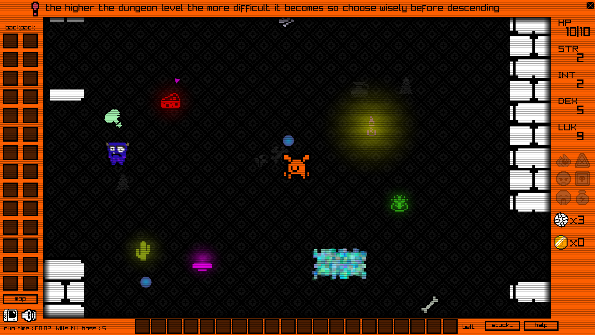

<h1>The Endless Dungeons of Pixel</h1>

 
<b>Download the game for Windows here https://nicholasimon.itch.io/the-endless-dungeons-of-pixel</b>
  
An arcade style rogue-lite game made as a hobby for Windows that you can play very easily using just a mouse. Made with Go https://go.dev/ and the Go bindings for Raylib https://github.com/gen2brain/raylib-go

PLEASE view the credits at the end for all the artwork used in the game. If you see artwork in the game that you made and you are not listed in the credits at the end of this page then please let me know

Remember this is just a personal project and there (probably lots of) bugs/issues - if you want to let me know about them (I probably won't fix them) you can contact me here support@nicholasimon.co.za

There is an issue/bug and sometimes the level will generate and you will be stuck in a room. Press the STUCK button bottom right and the next level will generate.

Has only been tested on resolutions up to 1920X1080 probably won’t look good on anything higher.

<b>INPUT:</b>
The entire game can be played using only a mouse, there is no option to use a controller or keyboard.

<b>Left Mouse Click:</b>  	
			
			On open floor moves to that area

			On an interactable object will pick up or use the object
			
			On inventory will equip/unequip or use an item
			

<b>Right Mouse Click:</b>

			
			With weapon equipped will attack

			With spade equipped will dig (only works in certain areas)
			
			On inventory will open options to delete or move the item
			

<b>KEYS:</b>
			
			
			ESC = Exits the game

			PAUSE = Does what it says
			
			M = Open/Closes Map (to teleport on the map click in a blue rectangle)
			
			L = Open/Closes Message Log
	
Most objects in the word have some purpose and can be interacted with so explore and interact to work out how to stay alive.
If you find gems and have them in your inventory at the end of the level (when going downstairs), if the combined gem value is high enough the shop will automatically open where you can upgrade.
Belt inventory only allows small items - potions, maps & scrolls, backpack inventory allows all items.
The KILLS TO BOSS (bottom left) text is a countdown of kills till the next boss will appear onscreen. When that number reaches zero a random boss will appear. 
Each level has more monsters than the previous meaning the further you go the more difficult the game becomes so make sure to power up as much as possible before descending downstairs.
Pets do nothing other than keep you company so don't bother trying to work out what they do.
There is no ending, the name of the game is THE ENDLESS DUNGEONS OF PIXEL hence it is endless.

<b>CREDITS</b>

Artwork

https://kenney.nl/

https://thkaspar.itch.io/

https://danaida.itch.io/

https://vectorpixelstar.itch.io/

https://pixelfrog-assets.itch.io/

https://arks.itch.io/

https://pipoya.itch.io/

Sound FX 

https://pixabay.com/sound-effects/

